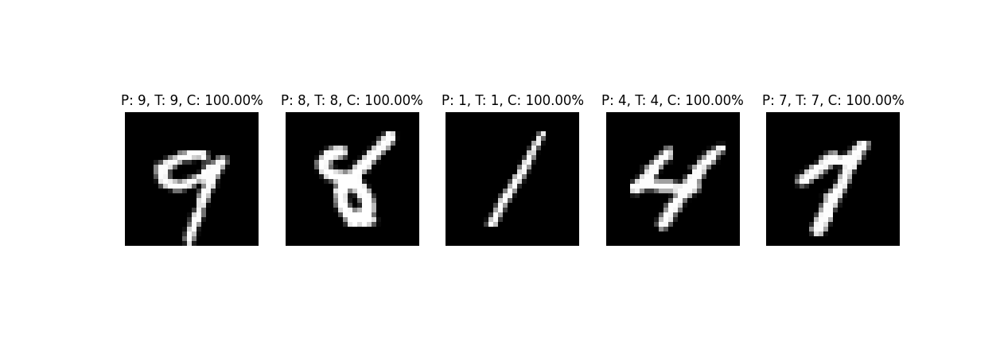
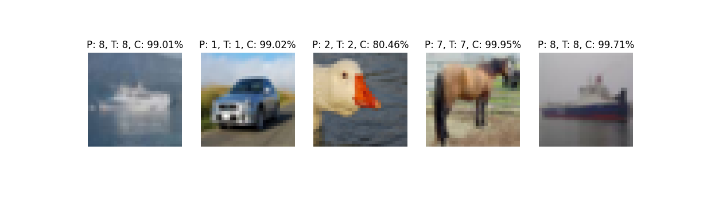
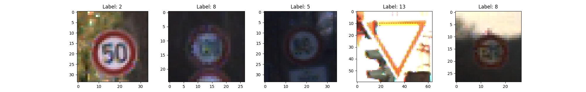
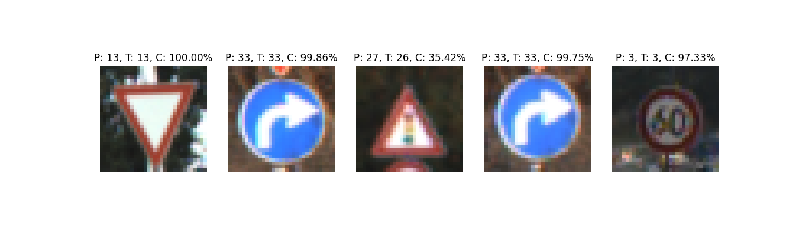

= Investigating popular datasets and DNN architectures
Dillon Sahadevan <dillon.sahadevan@ucalgary.ca>
:toc:

<<<

== Introduction

This paper is a continuation of "A Survey on Deep Neural Network Security in an Embedded Context". In this paper, we will be investigating some of the datasets and models described in survey. This paper will cover environment setup, dataset preparation, model training, and model evaluation.

== Environment Setup

=== Hardware

The following table describes the hardware used for this paper.

[cols="1,1", options="header"]
|===
| Component | Specification
| CPU | Ryzen 5 5600
| GPU | NVIDIA GeForce RTX 3070
| RAM | 32 GB
|===

=== Software

The following table describes the relevant software used for this paper.

[cols="1,1", options="header"]
|===
| Component | Specification
| OS | Windows 11
| Python | 3.8.5
| PyTorch | 1.8.1
| CUDA | 11.1
|===

=== Setting up the Environment

Python was installed from the official https://www.python.org/downloads/[Python website]. PyTorch was installed using the following command (found on the https://pytorch.org/get-started/locally/[PyTorch website]):

```bash
pip3 install torch torchvision torchaudio --extra-index-url https://download.pytorch.org/whl/cu116
```

To confirm successful installation, the following commands were run:

```bash
python3
>>> import torch
>>> torch.cuda.is_available()
True
```

=== Project Structure

The source code for this paper can be found on https://github.com/Dillonsd/ENEL592Assignment2[Github]. The directory structure is split into two parts: the 'models' directory and the 'datasets' directory. The 'models' directory contains the source code for the models that will be trained and evaluated. The 'datasets' directory contains the different datasets used.

For example, the following shows files relevant to MNIST and the CNN-2-2 model.

[plantuml, format=svg, opts="inline"]
----
skinparam Legend {
	BackgroundColor transparent
	BorderColor transparent
	FontName "Noto Serif", "DejaVu Serif", serif
	FontSize 17
}
legend
Root
|_ models
  |_ mnist
		|_ model.py
		|_ train.py
		|_ evaluate.py
		|_ ...
  |_ ...
|_ datasets
  |_ mnist
		|_ mnist.py
		|_ train
		|_ test
	|_ ...
end legend
----

== Datasets and Models

The following table describes the datasets and models that will be investigated in this paper.

[cols="1,1", options="header"]
|===
| Dataset | Model
| MNIST | CNN with 2 convolutional layers and 2 fully connected layers (CNN-2-2)
| CIFAR-10 | ResNet-18
| GTSRB | ResNet-18
|===

These datasets and models were chosen because they were described in the survey paper and were the most common amongst the works discussed in the survey.

== MNIST

The relevant files for MNIST can be found in the 'models/mnist/' and 'datasets/mnist/' directory.

=== Dataset

The MNIST dataset is a dataset of 60,000 28x28 grayscale images of the 10 digits, along with a test set of 10,000 images. The dataset is available from the https://pytorch.org/vision/stable/datasets.html#mnist[MNIST section] of the PyTorch documentation. The MNIST dataset is a popular dataset for testing image classification models and is often used as a "Hello World" example for image classification.

The following is a random sample of 5 images from the MNIST training dataset (these can be obtained by running the 'datasets/mnist/mnist.py' script).

image::media/mnist_sample.png[]

=== Model

The model used for MNIST is a CNN with 2 convolutional layers and 2 fully connected layers (CNN-2-2). The model is defined in the 'models/mnist/model.py' file. A summary of the model is shown below (this can be obtained by running the 'models/mnist/model.py' script).

```bash
----------------------------------------------------------------
        Layer (type)               Output Shape         Param #
================================================================
            Conv2d-1           [-1, 32, 24, 24]             832
            Conv2d-2             [-1, 64, 8, 8]          51,264
            Linear-3                 [-1, 1024]       1,049,600
            Linear-4                   [-1, 10]          10,250
================================================================
Total params: 1,111,946
Trainable params: 1,111,946
Non-trainable params: 0
----------------------------------------------------------------
Input size (MB): 0.00
Forward/backward pass size (MB): 0.18
Params size (MB): 4.24
Estimated Total Size (MB): 4.42
----------------------------------------------------------------
```

=== Training

The model was trained using the 'models/mnist/train.py' script. The following table describes the training parameters used.

[cols="1,1", options="header"]
|===
| Parameter | Value
| Batch Size | 100
| Learning Rate | 0.001
| Epochs | 50
| Optimizer | Adam
| Loss Function | Cross Entropy
|===

=== Evaluation

The model was evaluated using the 'models/mnist/evaluate.py' script. A final accuracy of 99.21% was achieved on the test set. The following is a random sample of 5 images from the MNIST test dataset along with the model's prediction, true value, and confidence (these can be obtained by running the 'models/mnist/evaluate.py' script).



== CIFAR-10

The relevant files for CIFAR-10 can be found in the 'models/cifar10/' and 'datasets/cifar10/' directory.

=== Dataset

The CIFAR-10 dataset is a dataset of 50,000 32x32 color images in 10 classes, along with a test set of 10,000 images. The dataset is available from the https://pytorch.org/vision/stable/datasets.html#cifar[CIFAR section] of the PyTorch documentation. The CIFAR-10 dataset is a subset of the CIFAR-100 dataset. The CIFAR-10 dataset is a popular dataset for testing image classification models.

The following is a random sample of 5 images from the CIFAR-10 training dataset (these can be obtained by running the 'datasets/cifar10/cifar10.py' script).


=== Model

The model used for CIFAR-10 is a ResNet-18 model. The model is defined in the 'models/cifar10/model.py' file. A summary of the model is shown below (this can be obtained by running the 'models/cifar10/model.py' script).

```bash
----------------------------------------------------------------
        Layer (type)               Output Shape         Param #
================================================================
            Conv2d-1           [-1, 64, 16, 16]           9,408
       BatchNorm2d-2           [-1, 64, 16, 16]             128
              ReLU-3           [-1, 64, 16, 16]               0
         MaxPool2d-4             [-1, 64, 8, 8]               0
            Conv2d-5             [-1, 64, 8, 8]          36,864
       BatchNorm2d-6             [-1, 64, 8, 8]             128
              ReLU-7             [-1, 64, 8, 8]               0
            Conv2d-8             [-1, 64, 8, 8]          36,864
       BatchNorm2d-9             [-1, 64, 8, 8]             128
             ReLU-10             [-1, 64, 8, 8]               0
       BasicBlock-11             [-1, 64, 8, 8]               0
           Conv2d-12             [-1, 64, 8, 8]          36,864
      BatchNorm2d-13             [-1, 64, 8, 8]             128
             ReLU-14             [-1, 64, 8, 8]               0
           Conv2d-15             [-1, 64, 8, 8]          36,864
      BatchNorm2d-16             [-1, 64, 8, 8]             128
             ReLU-17             [-1, 64, 8, 8]               0
       BasicBlock-18             [-1, 64, 8, 8]               0
           Conv2d-19            [-1, 128, 4, 4]          73,728
      BatchNorm2d-20            [-1, 128, 4, 4]             256
             ReLU-21            [-1, 128, 4, 4]               0
           Conv2d-22            [-1, 128, 4, 4]         147,456
      BatchNorm2d-23            [-1, 128, 4, 4]             256
           Conv2d-24            [-1, 128, 4, 4]           8,192
      BatchNorm2d-25            [-1, 128, 4, 4]             256
             ReLU-26            [-1, 128, 4, 4]               0
       BasicBlock-27            [-1, 128, 4, 4]               0
           Conv2d-28            [-1, 128, 4, 4]         147,456
      BatchNorm2d-29            [-1, 128, 4, 4]             256
             ReLU-30            [-1, 128, 4, 4]               0
           Conv2d-31            [-1, 128, 4, 4]         147,456
      BatchNorm2d-32            [-1, 128, 4, 4]             256
             ReLU-33            [-1, 128, 4, 4]               0
       BasicBlock-34            [-1, 128, 4, 4]               0
           Conv2d-35            [-1, 256, 2, 2]         294,912
      BatchNorm2d-36            [-1, 256, 2, 2]             512
             ReLU-37            [-1, 256, 2, 2]               0
           Conv2d-38            [-1, 256, 2, 2]         589,824
      BatchNorm2d-39            [-1, 256, 2, 2]             512
           Conv2d-40            [-1, 256, 2, 2]          32,768
      BatchNorm2d-41            [-1, 256, 2, 2]             512
             ReLU-42            [-1, 256, 2, 2]               0
       BasicBlock-43            [-1, 256, 2, 2]               0
           Conv2d-44            [-1, 256, 2, 2]         589,824
      BatchNorm2d-45            [-1, 256, 2, 2]             512
             ReLU-46            [-1, 256, 2, 2]               0
           Conv2d-47            [-1, 256, 2, 2]         589,824
      BatchNorm2d-48            [-1, 256, 2, 2]             512
             ReLU-49            [-1, 256, 2, 2]               0
       BasicBlock-50            [-1, 256, 2, 2]               0
           Conv2d-51            [-1, 512, 1, 1]       1,179,648
      BatchNorm2d-52            [-1, 512, 1, 1]           1,024
             ReLU-53            [-1, 512, 1, 1]               0
           Conv2d-54            [-1, 512, 1, 1]       2,359,296
      BatchNorm2d-55            [-1, 512, 1, 1]           1,024
           Conv2d-56            [-1, 512, 1, 1]         131,072
      BatchNorm2d-57            [-1, 512, 1, 1]           1,024
             ReLU-58            [-1, 512, 1, 1]               0
       BasicBlock-59            [-1, 512, 1, 1]               0
           Conv2d-60            [-1, 512, 1, 1]       2,359,296
      BatchNorm2d-61            [-1, 512, 1, 1]           1,024
             ReLU-62            [-1, 512, 1, 1]               0
           Conv2d-63            [-1, 512, 1, 1]       2,359,296
      BatchNorm2d-64            [-1, 512, 1, 1]           1,024
             ReLU-65            [-1, 512, 1, 1]               0
       BasicBlock-66            [-1, 512, 1, 1]               0
AdaptiveAvgPool2d-67            [-1, 512, 1, 1]               0
           Linear-68                 [-1, 1000]         513,000
================================================================
Total params: 11,689,512
Trainable params: 11,689,512
Non-trainable params: 0
----------------------------------------------------------------
Input size (MB): 0.01
Forward/backward pass size (MB): 1.29
Params size (MB): 44.59
Estimated Total Size (MB): 45.90
----------------------------------------------------------------
```

=== Training

The training script is defined in the 'models/cifar10/train.py' file. The following table describes the training parameters used.

[cols="1,1",options="header"]
|===
| Parameter | Value
| Batch Size | 128
| Learning Rate | 0.1
| Weight Decay | 5e-4
| Momentum | 0.9
| Epochs | 200
| Optimizer | SGD
| Loss Function | Cross Entropy
|===

=== Evaluation

The model was evaluated using the 'models/cifar10/evaluate.py' script. A final accuracy of 74.66% was achieved on the test set. The following is a random sample of 5 images from the CIFAR-10 test dataset along with the model's prediction, true value, and confidence (these can be obtained by running the 'models/cifar10/evaluate.py' script).



== GTSRB

The relevant files for GTSRB can be found in the 'models/gtsrb/' and 'datasets/gtsrb/' directory.

=== Dataset

The German Traffic Sign Recognition Benchmark (GTSRB) is a multi-class, single-image classification challenge held at the International Joint Conference on Neural Networks (IJCNN) 2011. The dataset consists of 43 classes of traffic signs. The images are 30x30 RGB images. The dataset is available from the https://pytorch.org/vision/stable/generated/torchvision.datasets.GTSRB.html#torchvision.datasets.GTSRB[GTSRB section] of the PyTorch documentation.

The following is a random sample of 5 images from the GTSRB dataset.



=== Model

The model used for GTSRB is a ResNet-18 model. The model is defined in the 'models/gtsrb/model.py' file. A summary of the model is shown below (this can be obtained by running the 'models/gtsrb/model.py' script).

```bash
----------------------------------------------------------------
        Layer (type)               Output Shape         Param #
================================================================
            Conv2d-1           [-1, 64, 16, 16]           9,408
       BatchNorm2d-2           [-1, 64, 16, 16]             128
              ReLU-3           [-1, 64, 16, 16]               0
         MaxPool2d-4             [-1, 64, 8, 8]               0
            Conv2d-5             [-1, 64, 8, 8]          36,864
       BatchNorm2d-6             [-1, 64, 8, 8]             128
              ReLU-7             [-1, 64, 8, 8]               0
            Conv2d-8             [-1, 64, 8, 8]          36,864
       BatchNorm2d-9             [-1, 64, 8, 8]             128
             ReLU-10             [-1, 64, 8, 8]               0
       BasicBlock-11             [-1, 64, 8, 8]               0
           Conv2d-12             [-1, 64, 8, 8]          36,864
      BatchNorm2d-13             [-1, 64, 8, 8]             128
             ReLU-14             [-1, 64, 8, 8]               0
           Conv2d-15             [-1, 64, 8, 8]          36,864
      BatchNorm2d-16             [-1, 64, 8, 8]             128
             ReLU-17             [-1, 64, 8, 8]               0
       BasicBlock-18             [-1, 64, 8, 8]               0
           Conv2d-19            [-1, 128, 4, 4]          73,728
      BatchNorm2d-20            [-1, 128, 4, 4]             256
             ReLU-21            [-1, 128, 4, 4]               0
           Conv2d-22            [-1, 128, 4, 4]         147,456
      BatchNorm2d-23            [-1, 128, 4, 4]             256
           Conv2d-24            [-1, 128, 4, 4]           8,192
      BatchNorm2d-25            [-1, 128, 4, 4]             256
             ReLU-26            [-1, 128, 4, 4]               0
       BasicBlock-27            [-1, 128, 4, 4]               0
           Conv2d-28            [-1, 128, 4, 4]         147,456
      BatchNorm2d-29            [-1, 128, 4, 4]             256
             ReLU-30            [-1, 128, 4, 4]               0
           Conv2d-31            [-1, 128, 4, 4]         147,456
      BatchNorm2d-32            [-1, 128, 4, 4]             256
             ReLU-33            [-1, 128, 4, 4]               0
       BasicBlock-34            [-1, 128, 4, 4]               0
           Conv2d-35            [-1, 256, 2, 2]         294,912
      BatchNorm2d-36            [-1, 256, 2, 2]             512
             ReLU-37            [-1, 256, 2, 2]               0
           Conv2d-38            [-1, 256, 2, 2]         589,824
      BatchNorm2d-39            [-1, 256, 2, 2]             512
           Conv2d-40            [-1, 256, 2, 2]          32,768
      BatchNorm2d-41            [-1, 256, 2, 2]             512
             ReLU-42            [-1, 256, 2, 2]               0
       BasicBlock-43            [-1, 256, 2, 2]               0
           Conv2d-44            [-1, 256, 2, 2]         589,824
      BatchNorm2d-45            [-1, 256, 2, 2]             512
             ReLU-46            [-1, 256, 2, 2]               0
           Conv2d-47            [-1, 256, 2, 2]         589,824
      BatchNorm2d-48            [-1, 256, 2, 2]             512
             ReLU-49            [-1, 256, 2, 2]               0
       BasicBlock-50            [-1, 256, 2, 2]               0
           Conv2d-51            [-1, 512, 1, 1]       1,179,648
      BatchNorm2d-52            [-1, 512, 1, 1]           1,024
             ReLU-53            [-1, 512, 1, 1]               0
           Conv2d-54            [-1, 512, 1, 1]       2,359,296
      BatchNorm2d-55            [-1, 512, 1, 1]           1,024
           Conv2d-56            [-1, 512, 1, 1]         131,072
      BatchNorm2d-57            [-1, 512, 1, 1]           1,024
             ReLU-58            [-1, 512, 1, 1]               0
       BasicBlock-59            [-1, 512, 1, 1]               0
           Conv2d-60            [-1, 512, 1, 1]       2,359,296
      BatchNorm2d-61            [-1, 512, 1, 1]           1,024
             ReLU-62            [-1, 512, 1, 1]               0
           Conv2d-63            [-1, 512, 1, 1]       2,359,296
      BatchNorm2d-64            [-1, 512, 1, 1]           1,024
             ReLU-65            [-1, 512, 1, 1]               0
       BasicBlock-66            [-1, 512, 1, 1]               0
AdaptiveAvgPool2d-67            [-1, 512, 1, 1]               0
           Linear-68                 [-1, 1000]         513,000
================================================================
Total params: 11,689,512
Trainable params: 11,689,512
Non-trainable params: 0
----------------------------------------------------------------
Input size (MB): 0.01
Forward/backward pass size (MB): 1.29
Params size (MB): 44.59
Estimated Total Size (MB): 45.90
----------------------------------------------------------------
```

=== Training

The training script is defined in the 'models/gtsrb/train.py' file. The training script uses the 'models/gtsrb/model.py' file to define the model. The training script uses the 'models/gtsrb/dataset.py' file to define the dataset. The following table describes the training parameters used.

[cols="1,1",options="header"]
|===
| Parameter | Value
| Batch Size | 256
| Learning Rate | 0.0001
| Scheduler | ReduceLROnPlateau
| Scheduler Parameters | patience=5, factor=0.1, mode='min'
| Epochs | 18
| Optimizer | Adam
| Loss Function | Cross Entropy
|===

=== Evaluation

The evaluation script is defined in the 'models/gtsrb/evaluate.py' file. A final accuracy of 73.11% was achieved on the test set. The following is a random sample of 5 images from the GTSRB test dataset along with the model's prediction, true value, and confidence (these can be obtained by running the 'models/gtsrb/evaluate.py' script).

